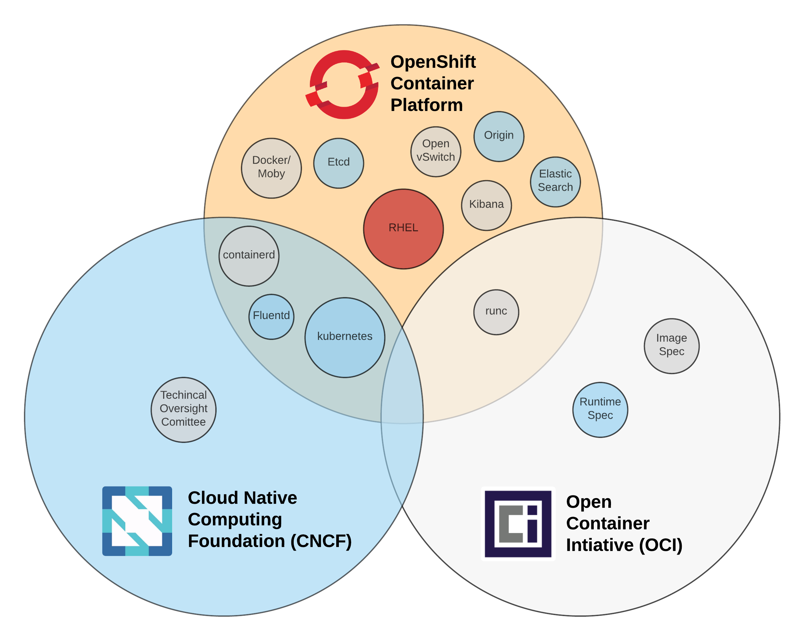

Now that you have an understanding of the different daemons, take a look at all of it together. 

``ps aux --forest``{{execute}}

Notice which daemons start which ones. Also, notice that the OpenShift API, Controller and Node processes are actually docker containers. There is a project to containerize all of the foundational daemons including the docker daemon on RHEL Atomic Host.

Looking at this all working togeter, it's important to realize that this entire toolchain is open source, but pieces parts are driven by different communities. Red Hat leads in all of these communities and brings all of these pieces together with OpenShift.

