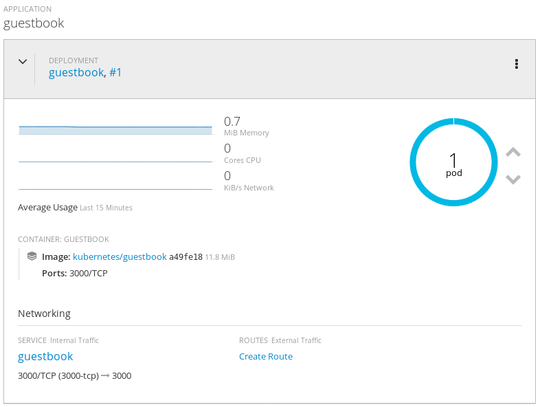
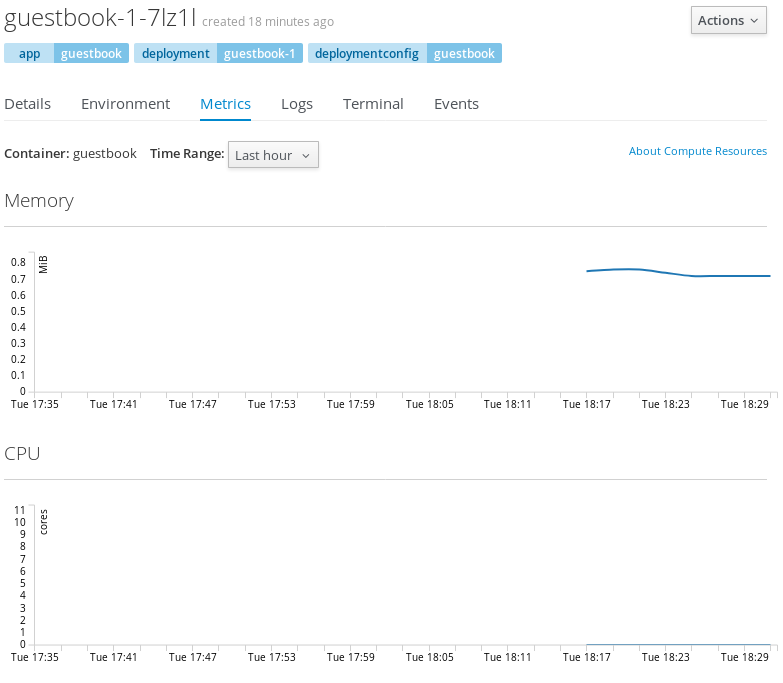

We will create an initial project where we deploy a sample application
that we will use to observe the metrics.

This time, 'cluster-admin' privileges are not required, so we will login as a
regular user.

To login to the OpenShift cluster used for this course from the _Terminal_,
run:

``oc login -u developer -p developer``{{execute}}

This will log you in using the credentials:

* **Username:** ``developer``
* **Password:** ``developer``

You should see the output:

```
Login successful.

You don't have any projects. You can try to create a new project, by running

    oc new-project <projectname>
```

To create a new project called ``myproject`` run the command:

``oc new-project myproject``{{execute}}

You should see output similar to:

```
Now using project "myproject" on server "https://172.17.0.41:8443".

You can add applications to this project with the 'new-app' command. For example, try:

    oc new-app centos/ruby-22-centos7~https://github.com/openshift/ruby-ex.git

to build a new example application in Ruby.
```

We will deploy a sample application:

``oc new-app kubernetes/guestbook``{{execute}}

Once the pod has been created, the metrics components will start to gather
information. To check the metrics using ``oc``, it is required to be
`system:admin` again:

``oc login -u system:admin``{{execute}}

Then perform the ``adm top pod`` command as follows:

``oc adm top pod --heapster-namespace='openshift-infra'  --heapster-scheme="https" -n myproject``{{execute}}

**NOTE:** Recent versions of ``oc`` [don't require](https://bugzilla.redhat.com/show_bug.cgi?id=1470003) the ``--heapster-namespace`` nor the ``--heapster-scheme`` flags.

You should see output similar to:

```
NAME                CPU(cores)   MEMORY(bytes)   
guestbook-1-7lz1l   0m           0Mi
```

*NOTE:* It can take a couple of moments for metrics to be available

As an exercise to the reader, explore the different ``oc adm top`` options,
including observing nodes utilization.

Login again as developer once you've finished observing the stats:

``oc login -u developer -p developer``{{execute}}

To access the web console, click on the _Dashboard_ button above the terminal
window. You can switch back to the terminal by clicking on the _Terminal_
button.

The actual URL of the web console for your environment is:

https://[[HOST_SUBDOMAIN]]-8443-[[KATACODA_HOST]].environments.katacoda.com

If you click on this you will also be taken to the _Dashboard_ tab. If you want to view the web console in a separate browser tab or window, right click on the URL and select the menu option to open it.

The next step is to login in the OpenShift web console:


Enter in the following credentials:

**Username:** ``developer``{{copy}}
**Password:** ``developer``{{copy}}

and click on _Log In_.

Click on the `myproject` project. You will be taken to the project overview page
which will list all of the routes, services, deployments, and pods that you have
running as part of your project.

If the metrics are properly deployed, there will be a new fancy graph showing
the current resource usage detailed by CPU, Memory and Network I/O per pod
in the overview section.



Accessing every pod details in "Applications" -> "Pods" -> "<pod name>" will
show a new tab named "Metrics" with a metrics historical graph that can be
used to browse usage from within a week.



Note the graph will show you detailed information if moving the mouse cursor
over the exact time the metric has been gathered.
