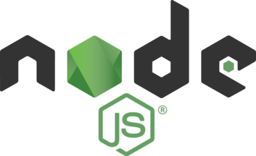

## What you will learn ##

In this scenario you will learn more about [Node.js](https://nodejs.org), one of the runtimes
included in [Red Hat OpenShift Application Runtimes](https://developers.redhat.com/products/rhoar).

You will take an existing sample Node.js application and modify it to address microservice concerns,
understand its structure, deploy it to OpenShift and exercise the interfaces between Node.js apps,
microservices, and OpenShift/Kubernetes.

## What is Node.js? 

Node.js is a JavaScript runtime built on [Chrome’s V8 JavaScript engine](https://developers.google.com/v8/). Node.js uses an event-driven,
non-blocking I/O model that makes it lightweight and efficient. Node.js' package ecosystem, [npm](https://www.npmjs.com/), is the
largest ecosystem of open source libraries in the world.

The Node.js runtime enables you to run Node.js applications and services in OpenShift while providing all
the advantages and conveniences of the OpenShift platform such as rolling updates, continuous delivery pipelines,
service discovery, and canary deployments. OpenShift also makes it easier for your applications to implement common
microservice patterns such as ConfigMap, Health Check, Circuit Breaker, and Failover.

> Node.js is a Technology Preview and is provided outside of a Red Hat subscription.

