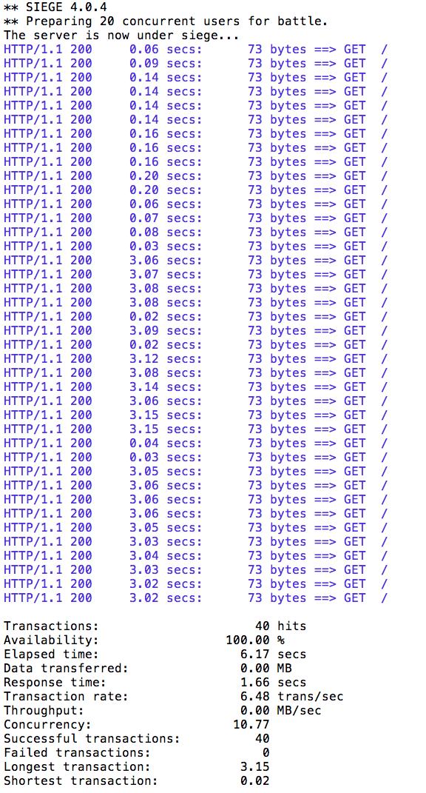
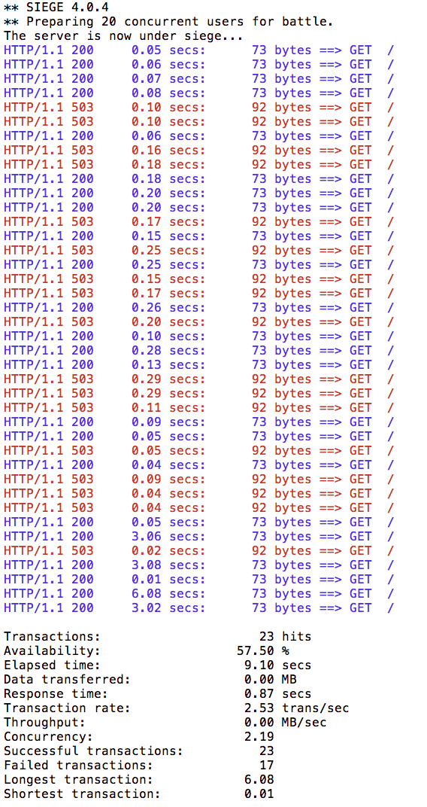

First, you need to insure you have a routerule in place. Let's use a 50/50 split of traffic:

Execute `istioctl create -f ~/projects/istio-tutorial/istiofiles/route-rule-recommendation-v1_and_v2_50_50.yml -n tutorial`{{execute T1}}

## Load test without circuit breaker

Let's perform a load test in our system with siege. We'll have 20 clients sending 2 concurrent requests each:

`siege -r 2 -c 20 -v http://customer-tutorial.[[HOST_SUBDOMAIN]]-80-[[KATACODA_HOST]].environments.katacoda.com`{{execute T1}}

You should see an output similar to this:

All of the requests to our system were successful, but it took some time to run the test, as the v2 instance/pod was a slow performer.

But suppose that in a production system this 3s delay was caused by too many concurrent requests to the same instance/pod. We don't want multiple requests getting queued or making the instance/pod even slower. So we'll add a circuit breaker that will **open** whenever we have more than 1 request being handled by any instance/pod.

Check the file `/istiofiles/recommendation_cb_policy_version_v2.yml`{{open}}.

Let's apply this `DestinationPolicy`: `istioctl create -f ~/projects/istio-tutorial/istiofiles/recommendation_cb_policy_version_v2.yml -n tutorial`{{execute T1}}

More information on the fields for the simple circuit-breaker <https://istio.io/docs/reference/config/istio.routing.v1alpha1.html#CircuitBreaker.SimpleCircuitBreakerPolicy>

## Load test with circuit breaker

Now let's see what is the behavior of the system running `siege` again:

`siege -r 2 -c 20 -v http://customer-tutorial.[[HOST_SUBDOMAIN]]-80-[[KATACODA_HOST]].environments.katacoda.com`{{execute T1}}

You should see an output similar to this:

You can run siege multiple times, but in all of the executions you should see some `503` errors being displayed in the results. That's the circuit breaker being opened whenever Istio detects more than 1 pending request being handled by the instance/pod.

## Clean up

Remove the `RouteRule`:  `istioctl delete routerule recommendation-v1-v2 -n tutorial`{{execute T1}}

Now remove the `DestinationPolicy`: `istioctl delete -f ~/projects/istio-tutorial/istiofiles/recommendation_cb_policy_version_v2.yml -n tutorial`{{execute T1}}